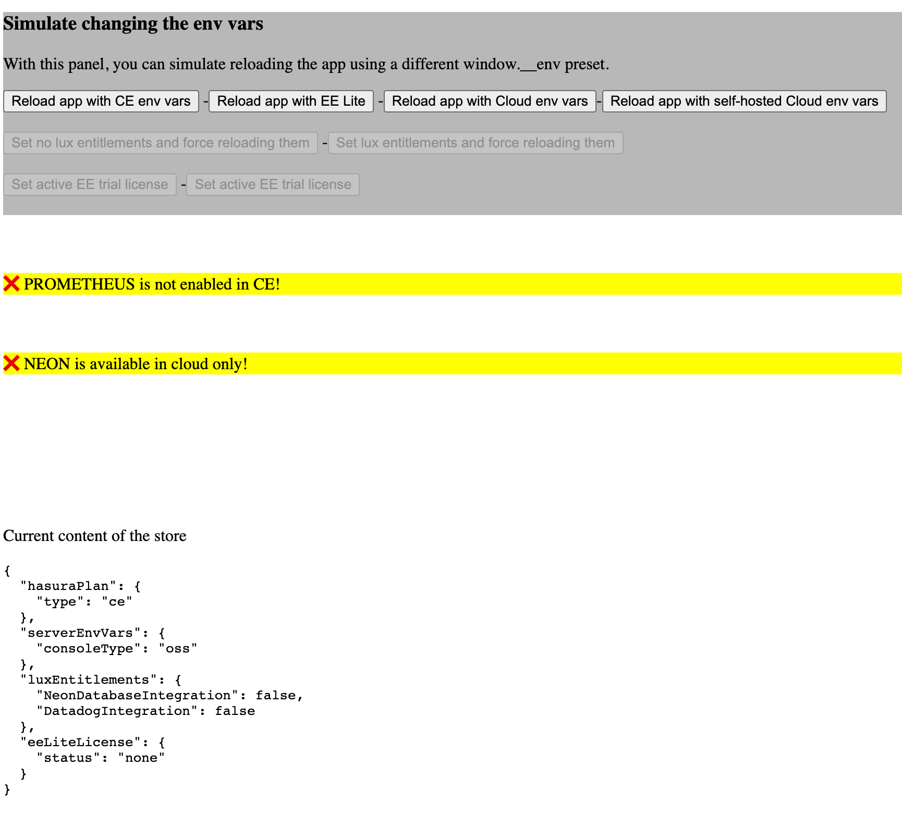

# Feature-First Hasura Console API POC


- [Context](#context)
- [The problem](#the-problem)
- [How the problem is tackled right now](#how-the-problem-is-tackled-right-now)
- [What's the Platform team goal?](#whats-the-platform-team-goal)
- [Next steps and the feedback loop](#next-steps)
- [What to expect from this POC](#what-to-expect-from-this-poc)
- [Basic use cases](#basic-use-cases)
  - [🙋 As a developer, I want to **show a feature only if it's enabled**](#-as-a-developer-i-want-to-show-a-feature-only-if-its-enabled)
  - [🙋 As a developer, I want to **refresh some data related to the Hasura Plan**](#-as-a-developer-i-want-to-refresh-some-data-related-to-the-hasura-plan)
  - [🙋 As a developer, I want to be sure **my component is not rendered until the Hasura Plan data is available** because I do not want to manage the loading state](#-as-a-developer-i-want-to-be-sure-my-component-is-not-rendered-until-the-hasura-plan-data-is-available-because-i-do-not-want-to-manage-the-loading-state)
  - [🙋 As a developer, I want to test my component in all its versions in **Storybook**](#-as-a-developer-i-want-to-test-my-component-in-all-its-versions-in-storybook)
- [Advanced use cases](#advanced-use-cases)
  - [🙋 As a developer, I want to **add one feature** to the catalogue of features managed by `useIsFeatureEnabled` (Neon, for instance)](#-as-a-developer-i-want-to-add-one-feature-to-the-catalogue-of-features-managed-by-useisfeatureenabled-neon-for-instance)
  - [🙋 As a developer, I want to **add one more async source of Hasura Plan info**](#-as-a-developer-i-want-to-add-one-more-async-source-of-hasura-plan-info)
  - [🙋 As a developer, I want to **add one more Console type**](#-as-a-developer-i-want-to-add-one-more-console-type)
  - [🙋 As a developer, I want to manage the **dynamic route** for my feature](#-as-a-developer-i-want-to-manage-the-dynamic-route-for-my-feature)
- [Three levels of abstraction](#three-levels-of-abstraction)
- [FAQ](#faq)
- [How can I play with the demo?](#how-can-i-play-with-the-demo)


<details id="context">
  <summary><b>Context</b></summary>

1. The Hasura Console can be loaded in six different "types", and two different "modes" (12 cases to manage). This is messy represented by the `window.__env` object the Hasura Console finds when loads.
2. When the Console is launched by the CLI server, we must care about [the old CLI server and the new one](https://github.com/hasura/graphql-engine-mono/pull/7256#discussion_r1071239279) (the cases to manage grows to 18).
3. There are additional things to consider that are retrieved dynamically
   1. Lux entitlements
   2. Pricing tiers
   3. EE Trial license
   4. ... and that's just the beginning...

*(here is a [good summary by @beaussan](https://hasurahq.slack.com/archives/C0423EHN686/p1676297462152259?thread_ts=1676291643.033329&cid=C0423EHN686) about the current situation).*

All of the above-mentioned points concur in showing some features or not, in trying to upsell Hasura to the customers, etc.
</details>

<details id="the-problem">
  <summary><b>The problem</b></summary>

The mess with `window.__env` and the above cases is already high, introducing a lot of bugs and PRs in the Console.

The engineers working on the Console not only need to understand when a feature is enabled or not but also to understand why in order to offer the best possible UX (in upselling terms too) to the customers.
</details>


<details id="how-the-problem-is-tackled-right-now">
  <summary><b>How the problem is tackled right now</b></summary>

1. Through [the `proConsole` module](https://github.com/hasura/graphql-engine-mono/blob/main/frontend/libs/console/legacy-ce/src/lib/utils/proConsole.ts) where we have been hidden checking the console type/mode in the last six months.
2. Through using the above utilities combined with custom checks, [here is an example](https://github.com/hasura/graphql-engine-mono/blob/734ac1a250ca8efed568ac15cd44fe384a30cf03/frontend/libs/console/legacy-ee/src/lib/components/Main/Main.js).
</details>


<details id="whats-the-platform-team-goal">
  <summary><b>What's the Platform team goal?</b></summary>

Essentially, to ease the developer life dealing with the above mess. This is possible through

1. Centralizing manage all the data/info/properties/vars that impact what the Console shows
2. Allow this centralized management to scale for future needs
3. Hide all the ~mess~ **implementation details** of dealing with the `window.__env`, pricing plans, entitlements, etc.

</details>


<details id="next-steps">
  <summary><b>Next steps and the feedback loop</b></summary>

The next steps are all about the fastest possible feedback loop.

- ✅ Implementing the POC
- 🚧 Gathering feedback from the ones who mostly requested it
- ⏳ Adjusting the APIs with the gathered feedback
- ⏳ Implementing a basic version in the Console to manage the EE Lite/EE Trials cases
- ⏳ Gathering feedback
- ⏳ Widening the APIs to the Cloud entitlements cases
- ⏳ Gathering feedback
- ⏳ Widening the APIs to the rest of the cases (prioritizing them)


</details>


## What to expect from this POC


This POC **includes**:
- a proposal of the TS APIs needed to hide/show a feature
- a proposal to identify the reasons why a feature is enabled/disabled
- a proposal to hide the previous APIs with a dedicated feature-only API
- some simplified version of the use cases the Console must deal with
- some mocks and utils to simulate the Console running in different modes and see the fake features reacting to the changes

This POC **does not include**:
- battle-tested code
- Storybook utilities
- definitive libraries and file system
- some thorough real use cases the Console must deal with
-
Please remember that the API design and names are open to be discussed!

## Basic use cases

### 🙋 As a developer, I want to **show a feature only if it's enabled**

```tsx
// File: features/Prometheus/Prometheus.tsx

// React component version
function Prometheus() {
  return (
    <IsFeatureEnabled feature="prometheus">
      <div>Prometheus</div>
    </IsFeatureEnabled>
  );
}

// React hook version
function Prometheus() {
  const {
    status
  } = useIsFeatureEnabled('prometheus');

  if(status === 'disabled') return null

  return <div>Prometheus</div>
}
```

And also, I want to know **why an existing feature is enabled or not**.

```diff
// File: features/Prometheus/Prometheus.tsx

// React component version
function Prometheus() {
  return (
-   <IsFeatureEnabled feature="prometheus">
+   <IsFeatureEnabled
+     feature="prometheus"
+     ifDisabled={(reasons: { doNotMatch }) => {
+       if (doNotMatch.eeLite) {
+         return <div>Prometheus is enabled for EE Lite only</div>
+       }
+     }}
+   >
      <div>Prometheus</div>
    </IsFeatureEnabled>
  );
}

// React hook version
function Prometheus() {
  const {
    status,
+   reasons: { doNotMatch }
  } = useIsFeatureEnabled('prometheus');

- if(status === 'disabled') return null
+ if(status === 'disabled') {
+  if (doNotMatch.eeLite) {
+    return <div>Prometheus is enabled for EE Lite only</div>
+  }
  }

  return <div>Prometheus</div>
}
```

<details>
  <summary><i>(here are the files diff-free)</i></summary>

```tsx
// File: features/Prometheus/Prometheus.tsx

// React component version
function Prometheus() {
  return (
    <IsFeatureEnabled
      feature="prometheus"
      ifDisabled={(reasons: { doNotMatch }) => {
        if (doNotMatch.eeLite) {
          return <div>Prometheus is enabled for EE Lite only</div>
        }
      }}
    >
      <div>Prometheus</div>
    </IsFeatureEnabled>
  );
}

// React hook version
function Prometheus() {
  const {
    status,
    reasons: { doNotMatch }
  } = useIsFeatureEnabled('prometheus');

  if(status === 'disabled') {
   if (doNotMatch.eeLite) {
     return <div>Prometheus is enabled for EE Lite only</div>
   }
  }

  return <div>Prometheus</div>
}
```

</details>

And also, I want to know **the current type the Console is running**.

```diff
// File: features/Prometheus/Prometheus.tsx

// React component version
function Prometheus() {
  return (
    <IsFeatureEnabled
      feature="prometheus"
-     ifDisabled={(reasons: { doNotMatch }) => {
+     ifDisabled={(reasons: { doNotMatch }, current: { hasuraPlan }) => {
        if (doNotMatch.eeLite) {
+         if(hasuraPlan.type === 'ce') {
+           return <div>Try EE Lite and give all the paid feature a try for free!</div>
+         }
+
          return <div>Prometheus is enabled for EE Lite only</div>
        }
      }}
    >
      <div>Prometheus</div>
    </IsFeatureEnabled>
  );
}

// React hook version
function Prometheus() {
  const {
    status,
    reasons: { doNotMatch }
+   current: { hasuraPlan }
  } = useIsFeatureEnabled('prometheus');

  if(status === 'disabled') {
    if (doNotMatch.eeLite) {
+     if(hasuraPlan.type === 'ce') {
+       return <div>Try EE Lite and give all the paid feature a try for free!</div>
+     }
+
      return <div>Prometheus is enabled for EE Lite only</div>
    }
  }

  return <div>Prometheus</div>
}
```

<details>
  <summary><i>(here are the files diff-free)</i></summary>

```tsx
// File: features/Prometheus/Prometheus.tsx

// React component version
function Prometheus() {
  return (
    <IsFeatureEnabled
      feature="prometheus"
      ifDisabled={(reasons: { doNotMatch }, current: { hasuraPlan }) => {
        if (doNotMatch.eeLite) {
          if(hasuraPlan.type === 'ce') {
            return <div>Try EE Lite and give all the paid feature a try for free!</div>
          }

          return <div>Prometheus is enabled for EE Lite only</div>
        }
      }}
    >
      <div>Prometheus</div>
    </IsFeatureEnabled>
  );
}

// React hook version
function Prometheus() {
  const {
    status,
    reasons: { doNotMatch }
    current: { hasuraPlan }
  } = useIsFeatureEnabled('prometheus');

  if(status === 'disabled') {
    if (doNotMatch.eeLite) {
      if(hasuraPlan.type === 'ce') {
        return <div>Try EE Lite and give all the paid feature a try for free!</div>
      }

      return <div>Prometheus is enabled for EE Lite only</div>
    }
  }

  return <div>Prometheus</div>
}
```

</details>

### 🙋 As a developer, I want to **refresh some data related to the Hasura Plan**

```tsx
// File: features/Neon/ForceRefetchLuxEntitlements.tsx
function ForceRefetchLuxEntitlements() {
  const refetchLuxEntitlements = useRefetchLuxEntitlements();

  return <button onClick={refetchLuxEntitlements}>Refetch Lux Entitlements</button>
}
```

### 🙋 As a developer, I want to be sure **my component is not rendered until the Hasura Plan data is available** because I do not want to manage the loading state

The whole Console is not rendered until all the data is available, there is no need to manage loading states.

### 🙋 As a developer, I want to test my component in all its versions in **Storybook**

This POC does not include any Storybook APIs but we will implement:
1. Some vertical components (for instance `<SimulateCloudConsole>`) that internally sets the store with the needed env vars and Hasura Plan data
2. A `<StorybookHasuraPlanControl>` that adds one more Storybook Control panel with the existing plugin @nicoinch implemented

## Advanced use cases

### 🙋 As a developer, I want to **add one feature** to the catalogue of features managed by `useIsFeatureEnabled` (Neon, for instance)

```ts
// File: libs/hasura-features/src/lib/features.ts

const neon: CompatibilityObject = { // <-- new object
  ce: 'disabled',
  cliMode: 'cliOrServer',

  cloud: 'enabled',
  selfHostedCloud: 'disabled',
  luxEntitlements: {
    NeonDatabaseIntegration: 'required',
    DatadogIntegration: 'notRequired',
  },

  eeLite: 'disabled',
  eeLiteLicense: 'notRequired',
};

export const features: Record<string, CompatibilityObject> = {
  prometheus,
  neon, // <-- the feature is added to the list of supported features
};
```
See the [features.ts file](/libs/hasura-features/src/lib/features.ts).

### 🙋 As a developer, I want to **add one more async source of Hasura Plan info**

Add one more function to `useLoadHasuraPlan`, like the existing `useFetchLuxEntitlements` and `useFetchEELiteLicense` examples.

See the [useLoadHasuraPlan.ts file](/apps/feature-first-hasura-console-poc/src/app/useLoadHasuraPlan.ts).

### 🙋 As a developer, I want to **add one more Console type**

*(This guide will be prepared for the final version of the library.)*


### 🙋 As a developer, I want to manage the **dynamic route** for my feature

A personal opinion: we should not have dynamic routes at all. Our customers know the product and hear about its feature here and there, I do not see value in showing "404" if the users navigate to `<console>/settings/prometheus` in CE. I'd prefer, instead, to show our users a dedicated message for every version of the Console:
1. Are the customers in CE? Let's tell them "Sorry, the feature is available only in EE Lite!"
2. Are the customers in EE Lite without license? Let's tell them "Do you want to try EE license??"
3. Are the customers in Cloud? Let's tell them "Go to the Cloud dashboard and set everything Prometheus"


## Three levels of abstraction

1. The `useIsFeatureEnabled`/`<IsFeatureEnabled />` APIs: used maybe 95% of the times
2. The `features.ts` module: used maybe 5% of the times, every time we need to add a new feature or get an existing feature controlled by the `useIsFeatureEnabled`/`<IsFeatureEnabled />` APIs
3. The `compatibility.ts`/`store.ts` modules: used maybe 1% of the times, only when we need to add one more async source Hasura plan info

## FAQ

**How the new APIs work under the hood?**

1. First of all, the application must create all the TanStack queries for all the dynamic data of the server, like the Lux entitlements, the EE Trial license details, etc.
2. Based on the env vars received from the server, some of the above queries are run (to avoid trying to load the Lux entitlements when in EE Lite, for instance)
3. When all the async data is received, the app can be rendered

(please note that in the real Console, some of the async data will be fetched/refetched after the authentication steps)

4. From now on, the `useIsFeatureEnabled` can tell if a feature is enabled or not (and why) thanks to a list of features
5. `useIsFeatureEnabled` is reactive, so for instance when an EE trial license is activated, `useIsFeatureEnabled` makes the React components consuming it re-render


**I see Rect APIs, but I do not see pure JavaScript APIs, why?**

React APIs includes "reactivity" by definition. Vanilla JavaScript APIs cannot offer the same reactivity in an easy way. If you need to consume the Hasura plan data offered by `useIsFeatureEnabled`, read it from a React component and pass it down to your vanilla JavaScript functions.

**How will I be able to access `window.__env` if the goal of this POC is also to stop accessing it?**

We will maybe expose a `useEnvVars_UNSECURE` hook and we will look at when/where is needed.

**I do not see anything about pricing plan, authentication, etc. in this POC, why?**

Because the goal of this POC is not to reproduce every Console case but to validate an idea to manage them.


**How can I explore the small codebase of this POC? What are the key parts?**

From the high-level consumers to the low-level functions:
1. [Prometheus.tsx](apps/feature-first-hasura-console-poc/src/app/features/Prometheus.tsx): a fake Prometheus feature that shows how the `useIsFeatureEnabled` can be used.
2. [Neon.tsx](apps/feature-first-hasura-console-poc/src/app/features/Neon.tsx): a fake Neon feature that shows how the `IsFeatureEnabled` component can be used.
3. [useLoadHasuraPlan.ts](apps/feature-first-hasura-console-poc/src/app/useLoadHasuraPlan.ts): a hook to load all the dynamic data of the Hasura plan. The final one for the Console could be very similar to it.
4. [features.ts](libs/hasura-features/src/lib/features.ts): this module will include all the features that depend on some details of the current Hasura plan.
5. [compatibility.spec.ts](libs/hasura-features/src/lib/compatibility.spec.ts): allows to simulate all the different case managed by `checkFeatureCompatibility`, the function at the core of `useIsFeatureEnabled`.


## How can I play with the demo?



Run `nx serve feature-first-hasura-console-poc` for a dev server. Navigate to http://localhost:4200/. The app will automatically reload if you change any of the source files.
